# ⚙️ System Architecture Flow

This document outlines the complete end-to-end execution flow of the AI-powered Resume Analysis and Interview Preparation platform built using a Retrieval-Augmented Generation (RAG) architecture. The system processes unstructured resume data, semantically matches it against Job Descriptions (JDs), identifies missing skills, and generates personalized interview preparation reports.

---

# 📌 Architecture Overview

The platform combines:

* **React.js** for the frontend interface
* **Node.js + Express.js** for backend APIs
* **LangChain** for orchestration
* **Gemini 1.5 Flash** for structured extraction and generation
* **FAISS / ChromaDB** for semantic vector storage
* **UnstructuredPDFLoader** for intelligent resume parsing
* **Puppeteer** for ATS-compatible PDF report generation

---

# 🧠 End-to-End System Flow

```mermaid
sequenceDiagram
    participant User as React Frontend
    participant Node as Express Backend
    participant Parser as UnstructuredPDFLoader
    participant VDB as FAISS/ChromaDB
    participant LLM as Gemini 1.5 Flash API

    User->>Node: POST /api/analyze (Resume PDF + JD Text)

    rect rgb(20, 40, 60)
    Note over Node, VDB: Phase 1 - Resume Ingestion & Vectorization

    Node->>Parser: Send Resume PDF
    Parser-->>Node: Return Structured Elements (Headers, Lists, Text Blocks)

    Node->>Node: Remove extra whitespace & sanitize content
    Node->>Node: Perform Header-Aware Chunking

    Node->>LLM: Generate Embeddings for Resume Chunks
    LLM-->>Node: Return Vector Embeddings

    Node->>VDB: Store vectors in FAISS / ChromaDB
    end

    rect rgb(60, 40, 20)
    Note over Node, LLM: Phase 2 - Job Description Processing

    Node->>LLM: Send JD + Structured Extraction Prompt
    LLM-->>Node: Return Mandatory Skills Array
    end

    rect rgb(20, 60, 40)
    Note over Node, VDB: Phase 3 - Semantic Retrieval & Matching

    Node->>VDB: Similarity Search for each extracted skill (Top-K=5)
    VDB-->>Node: Return Matching Resume Chunks + Similarity Scores

    Node->>Node: Compare scores against threshold
    Node->>Node: Identify Matched Skills & Skill Gaps
    end

    rect rgb(60, 20, 60)
    Note over Node, LLM: Phase 4 - AI Generation & Report Export

    Node->>LLM: Generate personalized interview prep using skill gaps
    LLM-->>Node: Return custom mock interview questions

    Node->>Node: Render ATS-compatible report using Puppeteer
    Node-->>User: Return JSON Dashboard + PDF Report URL
    end
```



---

# 🔄 Detailed Execution Breakdown

## 1. Frontend Request Handling

The user accesses the React.js application and uploads:

* A candidate resume in PDF format
* A target Job Description (JD)

The frontend packages the data into a `FormData` object and sends a `POST` request to the Express.js backend.

Example API Request:

```http
POST /api/analyze
Content-Type: multipart/form-data
```

---

# 📄 Phase 1 — Resume Ingestion & Vectorization

## Resume Parsing

The backend receives the uploaded PDF and processes it using:

```js
UnstructuredPDFLoader(mode="elements")
```

Instead of extracting the resume as one large block of text, the loader intelligently separates the document into structured elements such as:

* Headers
* Titles
* Bullet Lists
* Narrative Text
* Sections

Example:

* Skills
* Education
* Work Experience
* Certifications

---

## Data Sanitization

The extracted elements are cleaned before embedding generation.

The sanitization pipeline removes:

* Excess whitespace
* Broken line spacing
* Hidden PDF artifacts
* Formatting inconsistencies

This improves embedding quality and semantic retrieval accuracy.

---

## Header-Aware Chunking

Instead of traditional character-based chunking, the system performs **section-based chunking**.

### Why?

Traditional chunking can break context:

❌ Bad Chunk Example:

```text
Worked on AWS infrastructure...
...Bachelor of Engineering in Computer Science
```

This mixes unrelated sections.

### Implemented Solution

The system groups content under its parent header before embedding.

✅ Good Chunk Example:

```text
Header: Work Experience
Content:
- Worked on AWS EC2 deployment
- Managed Docker containers
- Built REST APIs using Node.js
```

This preserves semantic meaning during vector retrieval.

---

## Embedding Generation

Each cleaned chunk is converted into vector embeddings using the embedding model.

These embeddings represent semantic meaning numerically.

Example:

```text
"AWS EC2 deployment"
→ [0.183, -0.928, 0.441, ...]
```

---

## Vector Database Storage

Generated embeddings are indexed into:

* FAISS
* ChromaDB

The Vector Database enables:

* Semantic similarity search
* Fast retrieval
* Skill-based contextual matching

---

# 📑 Phase 2 — Job Description Processing

The backend processes the Job Description separately instead of storing it in the vector database.

---

## Structured Skill Extraction

The JD is sent to Gemini 1.5 Flash using a constrained extraction prompt.

Example Prompt:

```text
Extract only the mandatory technical skills,
tools, frameworks, and platforms from this
Job Description.

Return response as a JSON array.
```

---

## Example Output

```json
[
  "React.js",
  "Node.js",
  "AWS",
  "Docker",
  "MongoDB"
]
```

This structured output becomes the retrieval query set.

---

# 🔍 Phase 3 — Semantic Retrieval & Skill Matching

The backend loops through every extracted JD skill.

For each skill:

```text
Skill → Similarity Search → Resume Vector DB
```

---

## Semantic Matching

Instead of exact keyword matching, the system uses semantic retrieval.

Example:

| JD Skill   | Resume Content              | Match Result |
|------------|------------------------------|---------------|
| AWS        | Amazon Web Services          | ✅ Match       |
| Docker     | Containerized deployments    | ✅ Match       |
| Kubernetes | No related context found     | ❌ Missing     |

## Top-K Retrieval

The retriever fetches only the top 5 most relevant chunks.

```text
Top-K = 5
```

This reduces:

* Noise
* Irrelevant context
* Token usage
* Hallucination risk

---

## Similarity Threshold Filtering

Each retrieved chunk contains a similarity score.

Example:

```text
AWS → 0.91
Docker → 0.84
Kubernetes → 0.42
```

If the score falls below the configured threshold:

```text
score < threshold
```

the skill is added to:

```js
Skill_Gaps[]
```

---

# 🤖 Phase 4 — AI Generation & Interview Preparation

After retrieval, the backend prepares:

* Matched Skills
* Missing Skills
* Resume Context

This data is passed to Gemini for bounded generation.

---

## Personalized Interview Preparation

Example Prompt:

```text
The candidate is missing the following skills:
[AWS Lambda, Kubernetes]

Generate:
1. Personalized interview questions
2. Learning recommendations
3. Improvement roadmap
```

---

## Hallucination Control

To prevent unsupported AI responses, the system enforces:

* Context filtering
* Top-K retrieval
* Structured prompts
* Fallback handling

If insufficient context exists, the backend avoids unsupported generation instead of returning generic responses.

---

# 📄 ATS-Compatible Report Generation

The final analysis is converted into a professional PDF report using Puppeteer.

The report contains:

* Matched Skills
* Missing Skills
* Similarity Scores
* AI Interview Questions
* Learning Recommendations

Puppeteer renders the report through a headless Chromium browser to ensure:

* Consistent formatting
* ATS compatibility
* Cross-device rendering accuracy

---

# 🚀 Key Engineering Decisions

## Why Section-Based Chunking?

Resumes are structured documents.

Section-aware chunking preserves semantic relationships between content blocks and significantly improves retrieval quality compared to arbitrary character splitting.

---

## Why Semantic Search Instead of Keyword Matching?

Keyword search fails for terminology variations.

Example:

```text
AWS ≠ Amazon Web Services
```

Vector similarity solves this by matching meaning instead of exact text.

---

## Why Gemini 1.5 Flash?

The model was selected because of:

* Low latency
* Fast structured extraction
* Strong JSON formatting
* Cost-effective API usage
* Reliable prompt adherence

---

# 📊 System Optimization Strategies

| Optimization          | Purpose                       |
| --------------------- | ----------------------------- |
| Top-K Retrieval       | Reduce irrelevant context     |
| Similarity Thresholds | Improve retrieval accuracy    |
| Structured Prompting  | Enforce deterministic outputs |
| Context Filtering     | Minimize hallucinations       |
| Header-Aware Chunking | Preserve semantic meaning     |
| Sanitization Pipeline | Improve embedding quality     |

---

# 🔐 Security & Privacy Considerations

* Resume data is processed dynamically per request
* Sensitive information is minimized before prompt generation
* No raw resumes are permanently exposed to the LLM
* Vector retrieval reduces unnecessary token transmission

---

# 📦 Final API Response

The backend returns:

```json
{
  "matchedSkills": [],
  "missingSkills": [],
  "interviewQuestions": [],
  "reportUrl": "/reports/final-report.pdf"
}
```

---

# ✅ Business Impact

* Reduced manual resume screening effort
* Improved semantic skill matching accuracy
* Generated personalized interview preparation dynamically
* Reduced hallucinated outputs through bounded RAG workflows
* Improved retrieval precision using structured parsing and semantic chunking
